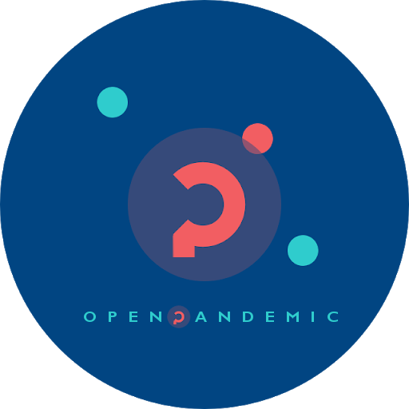
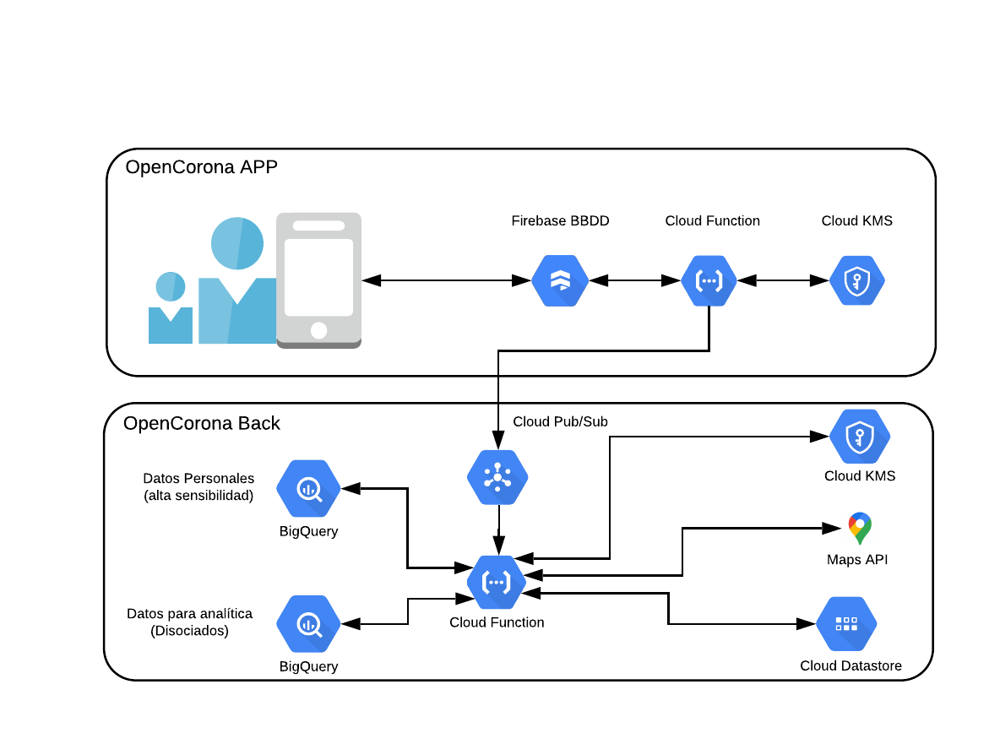

  
  <h2 align="left">OpenPandemic App</h2>

## **Openpandemic App - Back**

Esta aplicación está basada en la idea [Corona Madrid](https://coronamadrid.comunidad.madrid/)

Openpandemic App es una aplicación que ayuda a realizar una autoevaluación y un seguimiento de los ciudadanos en cuarentena a causa del coronavirus.

Este módulo, que hemos denominado *Openpandemic Back*, pretende servir como Backend Operacional cuyas principales funcionalidades son:

*   Capturar la información de dichos usuarios, separando datos en función de su confidencialidad:
    * Servir los datos confidenciales en una BBDD separada para su uso por las autoridades Sanitarias.
    * Brindar datos disociados con la interación del usuario para su explotación por científicos de datos.
*   Asegurar los requisitos máximos de seguridad y privacidad.

Para facilitar la disponibilidad de las herramientas y su explotación sencilla, el desarrollo de este módulo   se ha realizado a través del apalancamiento en las capacidades de la nube pública, en este caso de [Google cloud Platform.](https://cloud.google.com/gcp/)

## **Diagrama Técnico de la solución**

Como se observa en el diagrama técnico se han realizado los siguientes componentes:

## **Componentes de OpenPandemic Back**

Esta sección de OpenPandemic se ha pensado con la simplicidad y seguridad en mente.
No se han incluido partes excesivamente pesadas en ejecución para mantener el coste total contenido.
Además se ha pensado de forma que en el futuro pueda escalar en número de consumidores tanto de la generación de datos como  de su explotación. También hemos buscado modelos "serverless" para mantener los costes de operación bajos.

* **Cloud Function de lectura de la BBDD firebase**: Esta Cloud Function se encarga de copiar la información que llega a la base de datos a un sistema pub/sub para su posterior tratamiento. Además cifra el mensaje antes de incluirlo en el tópico para prevenir posibles "exploits". 

* **Cloud Pub/Sub para comunicar OpenPandemic Front y OpenPandemic Back**: La función del Pub/sub es fundamental:  
Utilizamos un medio altamente escalable para que pueda ser utilizado como vehículo para múltiples proceso de una manera segura.
En nuestro caso lo estamos utilizando para transmitir los datos de un proceso a otro de manera asíncrona.
En el futuro sería posible "enganchar" cientos de procesos vinculados a esta información de manera muy sencilla.

* **Cloud Function para escritura en BBDD**: Esta Cloud Function recibe los "push" del sistema Pub/sub y hace varias cosas:
   * Descifra el mensaje.
   * Verifica que el registro de BBDD no ha sido tratado ya, utilizando para ello una tabla en Google Cloud Datastore.
   * Llama a Google Maps para complementar información de posición con datos de menor precisión (barrio/zona/código postal) en el que vive el usuario registrado.
   * Escribe en la base de datos de explotación 
   correspondiente (Bigquery)

* **Dataset Big Query 1**: El primer dataset que hemos considerado es aquel que alberga los análisis realizados por los usuarios de la aplicación con todos sus datos completos. Esto es especialmente crítico porque se va a guardar información muy sensible, tanto localización como identificación y datos de usuario. Por ello están en un elemento separado, destinado a ser utilizado por las agencias de Salud.

* **Dataset Big Query 2**: El segundo Dataset que hemos puesto en marcha es especialmente interesante para el análisis de datos: contiene registros disociados de la actividad de los usuarios de la aplicación. Es decir, tiene los datos de los análisis y una aproximación de la localización del usuario (Barrio/zona/código postal) pero no sus datos personales ni localización exacta. Por lo tanto, están listos para utilizar por científicos de datos.

## **Stack tecnológico de OpenPandemic Back**
*  [**Google Cloud Functions:**](https://cloud.google.com/functions/)  Hemos elegido Cloud Functions por su simplicidad de manejo, su rapidez de desarrollo y por su modelo "serverless". Además Google ofrece 2MM de ejecuciones gratuitas al mes.

*  [**Geocoding API:**](https://developers.google.com/maps/documentation/geocoding/start) El API de Google Maps utilizada es la de Geocoding ya que nos permite conocer el barrio/zona/código postal en el que vive el usuario y, de esta manera, poder ofrecer la información de manera menos sensible, en lugar de coordenadas polares con la ubicación exacta damos la zona del usuario.

*  [**Cloud KMS:**](https://cloud.google.com/kms/) Cloud Kms es una solución de gestión de claves de encriptado que nos facilita la plataforma Google Cloud. La ventaja adicional es que es totalmente gestionada.

*  [**Cloud PUB/SUB:**](https://cloud.google.com/pubsub/) Cloud Pubsub es un sistema de mensajeria e ingestión de eventos basado en el paradigma "publicación subscripción". Tiene un "throughput" muy alto y es por eso que es adecuado para esta tarea. 
Como los demás productos comentados, no necesita de intervención para operarlo.

*  [**Cloud BigQuery:**](https://cloud.google.com/bigquery) Bigquery es una solución de "datawarehouse as a service". 
Nos permite poner rápidamente a disposición de múltiples usuarios los datos que se han ingestado en el sistema.
Está muy orientado a la analitica de datos y al "machine learning" por lo que es una solución ideal para este cometido.

# **Tratamiento de los datos en los Dataset**

La App por defecto sube 4 tipos de datos a firebase para que el gestor de la APP pueda hacer un seguimiento de los usuario:

* Datos personales sensibles (Nombre, DNI, Direccion, Género y Edad).
* Datos clinicos. 
* Localización y fecha.
* Resultados del test.

Una descripción más precisa de qué información guardamos en cada uno de los dataset comentados es la siguente:

## **Dataset Datos Personales (Tracking)**
Contiene el resultado de cada análisis personal, incluyendo aquellos datos sensibles que el propio usuario a dado de alta en la aplicación:
* Fecha/hora del test.
* Datos personales sensibles (Nombre, DNI, Dirección, Género, fecha de nacimiento).
* Datos clínicos ofrecidos por el usuario.
* Localización exacta basada en el terminal con el que se interactúa con la app.
* Resultado del test.

## **Dataset Datos Disociados (Modelling)**
En este caso, como comentamos anteriormente , también se encuentra el resultado del autoanálisis pero en lugar de encontrar los datos de usuario se manejan datos disociados, incluyendo un ID único no trazable y la información de posición con menos precisión que la servida por el usuario.

* Fecha/hora del test.
* ID de usuario (no trazable)
* Datos de usuario (Sexo, mes/año de nacimiento)
* Datos clínicos ofrecidos por el usuario.
* Localización aproximada (Nivel código postal)
* Resultado del test

---
# **OpenPandemic App - Back**

This application is based on the idea of the application [Corona Madrid](https://coronamadrid.comunidad.madrid/)

OpenPandemic App is an application that helps to perform a self-assessment and monitor citizens quarantined due to coronavirus.

This module, which we have called OpenPandemic Back, is intended to serve as an Operational Backend whose main functionalities are:

* Capturing the information of users, separating data according to their confidentiality:
 * Serve the confidential data in a separate database for its use by the health authorities.
 * Provide data dissociated with the user interaction for its exploitation by data scientists.
* Ensure maximum security and privacy requirements

In order to facilitate the availability of tools and their easy exploitation, the development of this module
has been done by leveraging the capacities of the public cloud, in this case the [Google Cloud Platform] (https://cloud.google.com/gcp/).

# **Technical diagram of the solution**

As shown in the technical diagram, the following components have been used:

## **OpenPandemic Back components**

This section of OpenPandemic has been designed with simplicity and security in mind. No excessively heavy running parts have been included to avoid the increase of total costs. It has also been designed to allow the scaling of the number of consumers and therefore the generation of data and its exploitation. We have also looked for "serverless" models to keep operating costs low.

* **Cloud Function for reading the firebase database**: This Cloud Function is responsible for copying the information that arrives at the database to a pub/sub system for subsequent processing. It also encrypts the message before including it in the topic to prevent possible "exploits".

* **Cloud Pub/Sub to communicate OpenPandemic Front and OpenPandemic Back**: The function of the Pub/sub is fundamental. We use a highly scalable medium so that it can be used as a vehicle for multiple processes in a secure manner. In our case we are using it to transmit the data from one process to another in an asynchronous way. In the future it would be possible to "hook" hundreds of processes linked to this information in a very simple way.

* **Cloud Function for writing in DB**: This cloud function receives the "push" from the Pub/sub system and carries on several tasks:

 * It decrypt the message.
 * It verifies that the database record has not already been processed.
 * It calls Google Maps to complement position information with less accurate data (neighborhood/area/zip code) where the registered user lives.
 * Write in the corresponding exploitation database (Bigquery)

* **Dataset Big Query 1**: The first dataset that we have considered is the one that save the analyses made by the users of the application with all their provided data. This is especially critical because it will store sensitive information, both location and identification, including user data. Therefore they are in a separate element, intended to be used by Health agencies.

* **Dataset Big Query 2**: The second Dataset we have implemented is especially interesting for data analysis: it contains records dissociated from the application users' activity. That is, it has the data from the analyses and an approximation of the user's location (neighborhood/area/zip code) but not his personal data or exact location. Therefore, they are ready to be used by data scientists.

# **OpenPandemic Back Technology Stack**

* [**Google Cloud Functions**](https://cloud.google.com/functions/): We have chosen Cloud Functions for its simplicity of use, its speed of development and its serverless model. Google also offers 2MM free runs per month.

* [**Geocoding API**](https://developers.google.com/maps/documentation/geocoding/start): The Google Maps API used is the Geocoding API since it allows us to know the neighborhood/area/zip code where the user lives and, thus, be able to offer the information in a less sensitive way, instead of polar coordinates with the exact location we give the user's area.

* [**Cloud KMS**](https://cloud.google.com/kms/): Cloud Kms is an encryption key management solution provided by the Google Cloud platform. The additional advantage is that it is fully managed.

* [**Cloud PUB/SUB**](https://cloud.google.com/pubsub/): Cloud Pubsub is a messaging and event management system based on the "publish subscription" paradigm. It has a very high "throughput" and that is why it is suitable for this task. Like the other products mentioned, it does not need any intervention to operate it.

* [**Cloud BigQuery**](https://cloud.google.com/bigquery): Bigquery is a "datawarehouse as a service" solution. It allows us to quickly make the data that has been entered into the system available to multiple users. It is very oriented to data analysis and "machine learning" so it is an ideal solution for this task.

# **Data processing in Datasets**

The default App uploads 4 types of data to firebase so that the APP manager can keep track of users:

* Sensitive personal data (Name, DNI, Address, Gender and Age)
* Clinical data
* Location and date
* Results of the test

A more extensive description of what information we keep in each of the datasets described before is the following:

### **Dataset Personal Data (Tracking)**

This Dataset contains the result of each personal analysis, including those sensitive data that users have registered in the application:

* Date/time of the test
* Sensitive personal data (Name, DNI, Address, Gender, date of birth)
* Clinical data provided by the user
* Exact location based on the terminal with which the app is interacted with
* Test result

### **Dataset Dissociated Data (Modelling)**

In this case, as mentioned above, the result of the self-analysis is also found, but instead of finding the user data, dissociated data is handled, including a unique non-traceable ID and position information with less precision than the position registered by the user.

* Date/time of the test
* User ID (non-traceable)
* User data (Gender, month/year of birth)
* Clinical data provided by the user.
* Approximate location (Zip code level)
* Test result